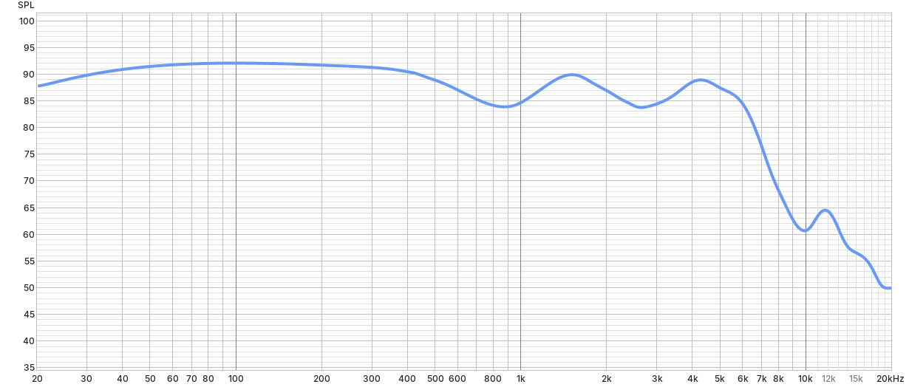

 

[Aliexpress link, earphones](https://aliexpress.ru/item/32841881186.html)

[Aliexpress link, tips](https://aliexpress.ru/item/4000165178739.html)

# My curve

# Feature

As you can see, I'm using flat-head earphones with tips that allow them to be used as in-ear earphones.
